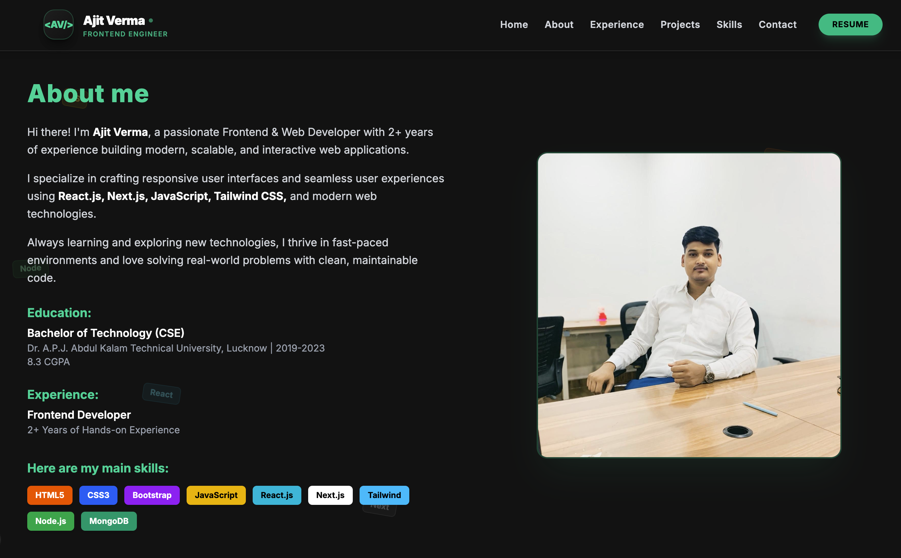

# 🚀 Ajit Verma - Portfolio

A modern and responsive developer portfolio built with **Next.js**, **React.js**, **Tailwind CSS**, and **Framer Motion**. This portfolio showcases my skills, projects, experience, and provides an easy way to get in touch.

## 🌐 Live Demo

🔗 https://ajit-verma.vercel.app/

## 📸 Preview




---

## ✨ Features

- Modern UI with Dark Theme
- Fully Responsive Design
- Smooth Animations using Framer Motion
- Reusable Components
- Skills & Experience Section
- Project Showcase
- Contact Form
- Fast Performance with Next.js
- SEO Friendly

---

## 🛠️ Tech Stack

- Next.js
- React.js
- TypeScript
- Tailwind CSS
- Framer Motion
- Lucide React
- EmailJS
- Git & GitHub

---

## 📂 Project Structure

```
portfolio/
│── app/
│── components/
│── public/
│── lib/
│── styles/
```

---

## 🚀 Getting Started

### Clone the repository

```bash
git clone https://github.com/ajitchaudhary714/portfolio.git
```

### Navigate to the project

```bash
cd portfolio
```

### Install dependencies

```bash
npm install
```

### Start the development server

```bash
npm run dev
```

Open http://localhost:3000 in your browser.

---

## 📬 Contact

**Ajit Verma**

📧 Email: ajitchaudhary714@gmail.com

💼 LinkedIn: https://www.linkedin.com/in/ajit-verma-174ba5250/

🐙 GitHub: https://github.com/ajitchaudhary714

🌐 Portfolio: https://your-portfolio-url.vercel.app

---

## 📄 License

This project is open source and available under the MIT License.

---

⭐ If you like this project, don't forget to give it a star!